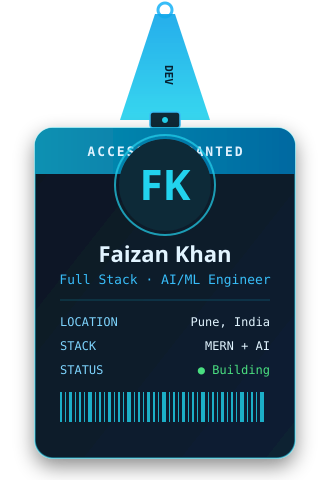
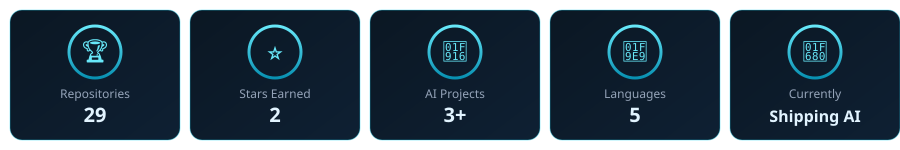

 

<table align="center" border="0">
<tr>
<td width="36%" align="center" valign="middle">

</td>
<td width="64%" valign="middle">

### 💫 About Me

I'm a Full Stack Developer based in Pune, India, specializing in the **MERN Stack** and transitioning into **AI/ML Engineering**. I build production-grade web apps with clean architecture and seamless API integration — and lately, AI agents that reason over real data.

- 🎯 **Goal:** Transitioning into an AI/ML Engineer role
- 🌱 **Currently building:** AI systems with **LangChain**, **RAG pipelines**, and **LangGraph**
- 💬 **Ask me about:** Full Stack Development, AI Agents, or React optimization

 

</td>
</tr>
</table>

 

### 🚀 Featured Projects

| Project | What it does | Stack |
|:---|:---|:---:|
| [**AI Resume Enhancer**](https://github.com/Faizankhan17623/AI-Resume-Enhancer-v2) | Full-stack AI resume review app — ATS scoring, resume chat coaching, payments, admin dashboard. | MERN + AI |
| [**RAG Application**](https://github.com/Faizankhan17623/Rag-Application) | Retrieval-Augmented Generation pipeline for grounded, context-aware AI responses. | LangChain / RAG |
| [**AI Notes Summarizer**](https://github.com/Faizankhan17623/AI-Notes-Summarizer-v2) | AI-powered app that condenses notes into concise, structured summaries. | MERN + AI |
| [**GTA Clone**](https://github.com/Faizankhan17623/Gta-Clone) | Open-world browser game — driving, helicopters, weapons, police AI, day/night cycle. | JavaScript |

 

### 💻 Tech Stack

#### 🎨 Frontend

#### ⚙️ Backend & Systems

#### 🤖 AI / ML & Data Science

#### 🗄️ Databases & DevOps

 

### 📊 GitHub Stats &amp; Graphs

  

  

<!-- 📈 Contribution Activity Graph -->

  

### 🐍 Watch the snake eat my contributions

  

  

<em>"I don't just want to write code that works — I want to build systems that think."</em>
 
— Faizan Khan

