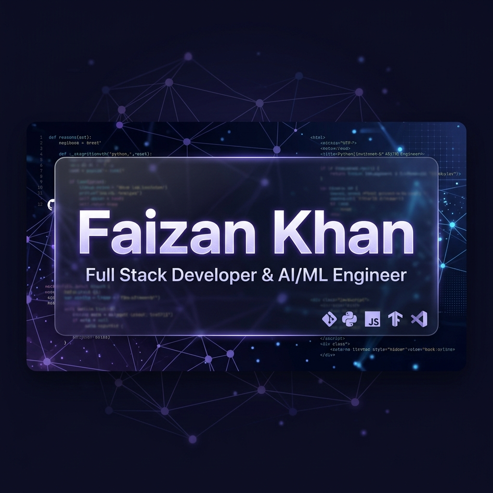

  

 

  <h3>🚀 Full Stack Developer & AI/ML Engineer</h3>
  
Passionate about building scalable, high-performance applications and intelligent systems.

---

### 💫 About Me
I am a Full Stack Developer based in Pune, India, specializing in the **MERN Stack** and transitioning into **AI/ML Engineering**. I build production-grade web applications with a focus on clean code, component architecture, and seamless API integration.

- 🎯 Goal: Transitioning to an AI/ML Engineer role.
- 💬 Ask me about Full Stack Development, AI Agents, or React optimization.

 

### 🌐 Connect with Me

  
  

---

### 🌱 Currently Building
Currently building advanced AI systems using **LangChain**, **RAG pipelines**, and **LangGraph** — actively shipping toward an AI/ML Engineer role.

---

### 🚀 Featured Projects

| Project | What it does | Stack |
|---|---|---|
| [**AI Resume Enhancer**](https://github.com/Faizankhan17623/AI-Resume-Enhancer-v2) | Full-stack AI resume review app — ATS scoring, resume chat coaching, payments, and an admin dashboard. | MERN + AI |
| [**RAG Application**](https://github.com/Faizankhan17623/Rag-Application) | Retrieval-Augmented Generation pipeline for grounded, context-aware AI responses. | LangChain / RAG |
| [**AI Notes Summarizer**](https://github.com/Faizankhan17623/AI-Notes-Summarizer-v2) | AI-powered app that condenses notes into concise, structured summaries. | MERN + AI |
| [**GTA Clone**](https://github.com/Faizankhan17623/Gta-Clone) | Open-world browser game — driving, helicopters, weapons, police chase AI, day/night cycle, zero build step. | JavaScript |

---

### 💻 Tech Stack

#### 🎨 Frontend Development

#### ⚙️ Backend & Systems

#### 🤖 AI / ML & Data Science

#### 🗄️ Databases & DevOps

---

### 📊 GitHub Analytics

  

---

  <em>"I don't just want to write code that works — I want to build systems that think."</em>
   
  — Faizan Khan

 

  

