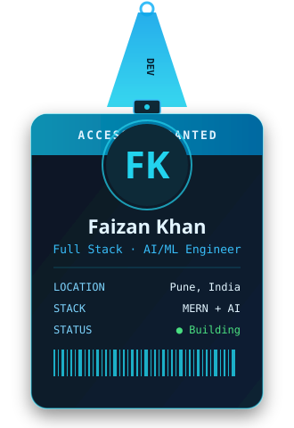

 

<table align="center" border="0">
<tr>
<td width="36%" align="center" valign="middle">

</td>
<td width="64%" valign="middle">

### 💫 About Me

I'm a Full Stack Developer from Pune, India. I build complete **MERN** products end to end: auth, payments, admin dashboards, and the AI features on top. My apps use LLMs for real work, like reviewing resumes, turning notes into study kits, and running a chat agent that calls live tools.

- 🛠️ **I build:** Full-stack web apps with React, Node.js, Express and MongoDB
- 🤖 **AI work:** LLM integration with Groq, tool-calling agents, streaming chat, speech-to-text
- 🌱 **Learning now:** LangChain, RAG pipelines and LangGraph
- 🎓 **Education:** BCA (CGPA 8.90), MCA in progress
- 💬 **Ask me about:** React + Redux apps, Express APIs, building AI features into real products

 

</td>
</tr>
</table>

 

## 🚀 Featured Projects

### 📄 [Resumify](https://github.com/Faizankhan17623/AI-Resume-Enhancer-v2) &nbsp;·&nbsp; [Live ↗](https://ai-resume-enhancer-v2.vercel.app/)
AI career platform for job seekers and recruiters.

- AI resume review with ATS-style fit scoring, plus AI cover letters and mock interviews
- Resume builder with PDF and DOCX export
- Recruiter job board with proctored tests that track the candidate's face in the browser (TensorFlow.js)
- Razorpay payments with AI credits, Google/GitHub OAuth, email OTP

`React 19` `Redux Toolkit` `Tailwind` `Express 5` `MongoDB` `Groq` `Razorpay` `TensorFlow.js`

### 📚 [Notewise](https://github.com/Faizankhan17623/Ai-Notes-Summarizer) &nbsp;·&nbsp; [Live ↗](https://ai-notes-summarizer-phi.vercel.app/)
AI study companion that turns notes into a full study kit.

- Summarizes text, PDF, DOCX, web pages and audio (Whisper transcription)
- Chat with your notes, streamed live over SSE, with voice input
- Spaced-repetition flashcards, quizzes, adaptive mock exams and study plans
- Shared study rooms, two-factor login, paid plans and an admin analytics dashboard

`React 19` `Redux Toolkit` `Tailwind` `Express 5` `MongoDB` `Groq` `Whisper` `Render`

### 🔎 [Scout](https://github.com/Faizankhan17623/Scout) &nbsp;·&nbsp; [Live ↗](https://scout-kappa-eight.vercel.app/)
Chat agent that decides on its own when to use live tools.

- Real tool-calling loop: up to 5 rounds per answer, 10 in deep-research mode
- 7 tools: web search (Tavily), weather, Wikipedia, page reader, image generation, GitHub repo explainer, code runner
- Voice in and voice out, PDF uploads, saved conversations, admin dashboard

`React 19` `Express` `MongoDB` `Groq` `Tavily` `Tool Calling`

### 🎮 [Open City (GTA-style game)](https://github.com/Faizankhan17623/gta-clone)
3D open-world game that runs in the browser, about 34,000 lines of JavaScript.

- Procedural city with drivable cars and helicopters, using hand-written physics
- Police with a 5-star wanted level and attack drones
- Day/night cycle, rainstorms, bloom and ambient occlusion
- Works with keyboard, gamepad and touch, and installs as a PWA

`Three.js` `JavaScript` `Web Audio API` `PWA`

 

## 💻 Tech Stack

**Frontend** 

**Backend & Databases** 

**AI** 

**Cloud & DevOps** 

![GitHub Actions](https://img.shields.io/badge/GitHub_Actions-155e75?style=for-the-badge&logo=githubactions&logoColor=w
